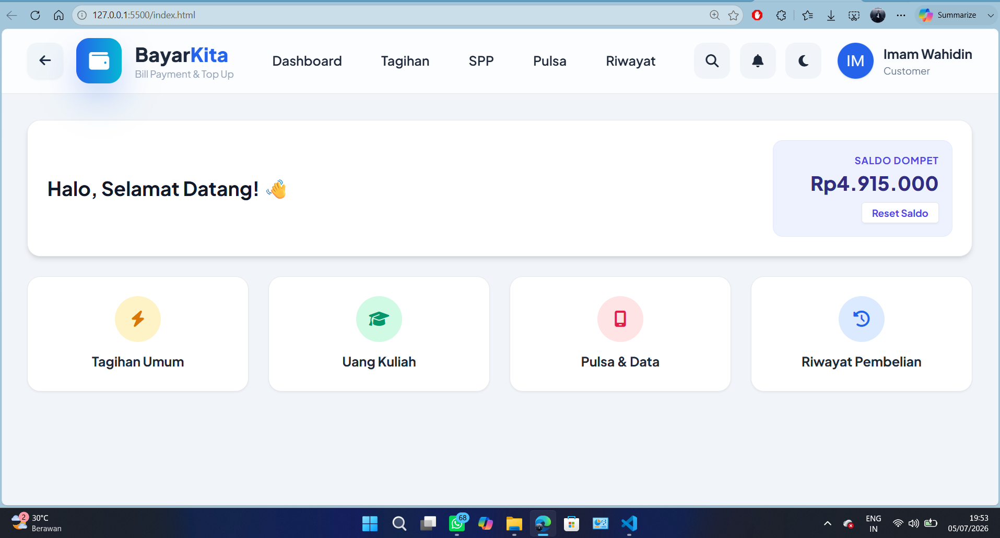
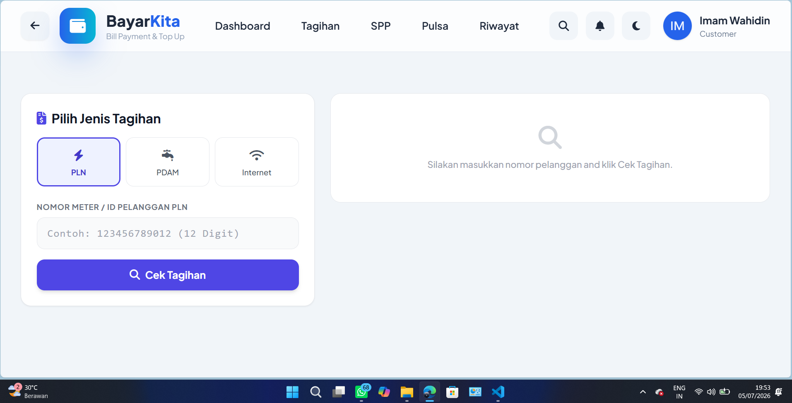

# 💳 BayarKita

## Nama Aplikasi
**BayarKita – Bill Payment & Top Up**

## Deskripsi Singkat
BayarKita merupakan aplikasi pembayaran tagihan berbasis web yang memudahkan pengguna melakukan pembayaran tagihan PLN, PDAM, Internet, UKT/SPP, pembelian pulsa dan paket data, serta melihat riwayat transaksi dalam satu aplikasi. Aplikasi dibuat menggunakan HTML, Tailwind CSS, dan JavaScript dengan konsep **Single Page Application (SPA)** sehingga perpindahan halaman berlangsung tanpa refresh.

## Cara Menjalankan
1. Download atau clone proyek.
2. Pastikan seluruh file berada dalam satu folder.
3. Buka file **index.html** menggunakan browser.
4. Aplikasi siap digunakan.

## Fitur
- Dashboard
- Pembayaran Tagihan (PLN, PDAM, Internet)
- Pembayaran UKT/SPP
- Pembelian Pulsa & Paket Data
- Riwayat Transaksi
- Saldo Dompet Digital
- Navigasi tanpa refresh (SPA)

## Teknologi
- HTML5
- Tailwind CSS
- JavaScript
- Font Awesome

## Struktur Proyek

```text
BayarKita/
├── index.html
├── app.js
├── data.js
├── README.md
└── assets/
```

## Screenshot Aplikasi

### Dashboard



### Menu Tagihan



### Menu UKT / SPP


### Riwayat Transaksi


## Pengembang
**Imam Wahidin**
